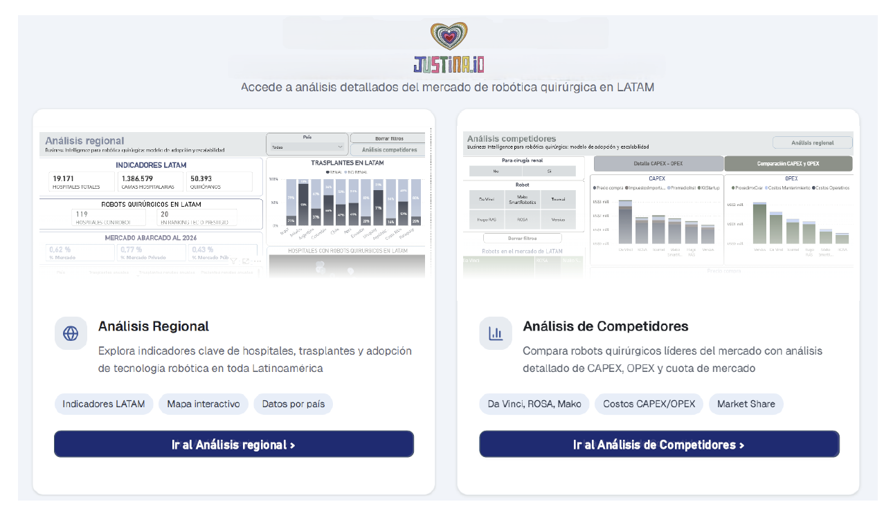

### 🏥 Business Intelligence para Robótica Quirúrgica – Proyecto Justina

---

#### 📊 Presentación de caso

Un equipo académico-tecnológico está evaluando la factibilidad de desarrollar Justina, un robot asistido para cirugía renal mínimamente invasiva.
En esta etapa temprana, uno de los principales desafíos no es solo tecnológico, sino estratégico y económico: comprender si existe un modelo de adopción viable para robótica quirúrgica en contextos como América Latina.

> Objetivo:
> 
> - Analizar el **mercado potencial** de robótica quirúrgica (TAM, SAM, SOM) con foco regional.
> - **Comparar costos y modelos** de negocio de soluciones existentes (ej. da Vinci, Versius, Hugo RAS).
> - Diseñar un **modelo económico preliminar** para Justina (CAPEX, OPEX, TCO).
> - Explorar **estrategias de adopción** en hospitales públicos, privados y universitarios.
> - Definir **indicadores clave (KPIs)** para evaluar impacto clínico y económico.

El resultado esperado es un **modelo de negocio en heathtech y adopción basado en datos**, que permita evaluar la **viabilidad económica del proyecto en LATAM y sirva como insumo para financiamiento, alianzas estratégicas y decisiones de diseño**.

> **NO SE PROVEE NINGÚN DATO INICIAL PARA EL ESTUDIO**
---

### 👩🏻‍💻 Mi rol

- **Data Analyst**: planteo estratégico del problema, diseño del modelo (db Países, Hospitales, Competidores, relaciones), establecimiento del enfoque de la búsqueda y los objetivos del proyecto. Búsqueda y verificación de datos de fuentes confiables. ETL en Power Query dentro del entorno Power BI y diseño y armado del tablero final definiendo insights.

- **BI Analyst**: análisis y extracción de conclusiones, KPIs y definición de futuras líneas de estudio. Redacción del informe y speech de la presentación.
---

#### 🗄 Modelo de Datos 

Construido a partir de código **Python** aplicando **Machine Learning con IA generativa**. Se muestra el modelo relacional creado en **SQLServer**:

  

  

Se construyó un **pipeline de datos completo**, desde la recolección de información pública y benchmarks del sector hasta el modelado y visualización en dashboards interactivos.

---

## 📊 Reporte BI

Preguntas "disparadoras" que dieron pie a la estrucuración del análisis:

- Caracterización de la cirugía robótica actual presente en Latinoamérica

  ¿La tecnología de cirugía robótica ya está presente en Latinoamérica? ¿En qué países de la región?
  ¿Qué tecnologías fueron adquiridas? ¿Cuál predomina actualmente?
  ¿Los robots son adquiridos solo por hospitales o instituciones privadas dado su alto costo? ¿O los gobiernos de LATAM también apuestan a la inversión en estas tecnologías para sus hospitales públicos?
  ¿Qué tipos de cirugía se realizan?

- Caracterización de los competidores

  ¿Cuáles son los robots que se comercializan en LATAM? ¿Qué compañías lo desarrollan?
  ¿Para qué tipo de cirugía aplica cada uno?
  ¿Qué aspectos los diferencian?

- Delimitación de casos de patología y cirugía renal en la región

  ¿Cuántos pacientes renales por año existen en los países de LATAM?
  ¿Qué cantidad de cirugías renales se realizan anualmente? ¿Cuántas de ellas corresponden a transplantes?
  ¿Cuál es el costo de una cirugía renal promedio en la región?

- Comparación de costos relativos a la adquisición de las diferentes tecnologías

  ¿El costo del equipo es el factor condicionante para su adquisición en LATAM dada la situación económica de la región?¿Cuáles son los factores que evalúan los clientes al momento de la compra?
  ¿Qué parámetros o variables se deben considerar a la hora de calcular los indicadores CAPEX, OPEX, TCO aplicados a cirugía robótica renal con foco regional? ¿Y para el TAM, SAM y SOM?
  ¿Qué características económicas permitirían a Justina ser una tecnología competitiva en el mercado actual?

---
#### 📋 Cover 

  

#### 📋 Análisis regional

  

- En la región latinoamericana existe un total de 19.171 hospitales, 1,3 millones de camas hospitalarias y alrededor de 50 mil quirófanos. De ese total de hospitales en la región, 43% son públicos y 57% son de gestión privada.
- De los 19.171 hospitales, 119 ya cuentan actualmente con robots quirúrgicos en sus instalaciones, 35 (29%) son de gestión pública y 84 (71%) son de gestión privada. Además, 20 de esos 119 fueron reconocidos dentro de los Rankings Intellat de Tecnología o Prestigio (un ranking regional basado en metodología con alta rigurosidad probada por 16 años en LATAM, que cuenta con difusión local y regional masiva).

- Solo un 0,62% del mercado latinoamericano sanitario cuenta con este tipo de tecnologías, menor al 1%.
- A continuación, dentro de la misma hoja, podemos analizar la tabla con valores comparativos por país de cantidad de trasplantes anuales, cantidad de trasplantes renales anuales y cantidad de pacientes renales por país.
Junto al gráfico de barras 100% apiladas de la derecha, que clasifica los trasplantes en los diferentes países de LATAM en Renal y No Renal, podemos concluir:

- Los países con mayor porcentaje de trasplantes renales respecto al los no renales de la región son en primer lugar: México (90%), luego Uruguay (77%) y en tercer lugar Colombia (66%).
- Sin embargo, los volúmenes de trasplantes totales no son los mismos en todos los países, y como observamos en la tabla, los países con mayor cantidad de trasplantes renales anuales son Brasil (6.320), México (2.783) y Argentina (1.674).
- En términos de pacientes renales (columna de la tabla), tenemos a Argentina (3.605.945) , México (2.423.673) y Brasil (1.525.544) al 2026 en el top 3.

Esto posiciona a México dentro del top 3 de todas las consideraciones.

- Por último en esta hoja, observamos la distribución de los hospitales de LATAM que cuentan actualmente con robot quirúrgico. Brasil toma el primer lugar con un total de 33 hospitales, México con 22 y Chile 15.

#### 📋 Análisis de competidores

  

- El gráfico de mapa de áreas expone la predominancia de la presencia del robot Da Vinci en Latinoamérica con un 60,4% del mercado ya abarcado. Este número toma estas dimensiones a pesar de que el Precio de compra de este robot es el más alto, de unos U$D 2,5 millones, como se observa en el gráfico a su derecha (abajo).
- En el gráfico de barras de arriba a la derecha vemos las comparativas de los valores de CAPEX y OPEX de los diferentes robots, siendo el Da Vinici el que representa la mayor inversión inicial (CAPEX = U$D 3,1 millones) con gran diferencia, mientras que el resto mantienen valores relativamente comparables (CAPEX ronda los U$D 2 millones). Lo curioso de este gráfico es el caso del robot Versius de origen británico, que requiere la menor inversión inicial (CAPEX = U$D 1,3 millones) dentro de las opciones, pero en contraparte presenta el costo variable de mantenimiento más alto de la lista (U$D 2,1 millones anuales contra alrededor de U$D 1 millón para el resto de robots).

---

### 📊 Explorar el Informe Interactivo

#### 👉 **[Interactuá con el reporte BI completo aquí](https://app.powerbi.com/view?r=eyJrIjoiZjdjMWYyYzktZjRmZi00N2I4LTlmNzktMjJhNzI3ODFmZjk2IiwidCI6Ijc3MDI2YzQzLTFmNWMtNDEyYy1iNjg1LTJkNTM4Y2Q4NWIzMCIsImMiOjR9)**
---
#### 📚 Documentación del Proyecto

Para ampliar la información del análisis y conocer las CONCLUSIONES y FUTURAS LÍNEAS DE ESTUDIO del proyecto:

📄 **Descargar o visualizar el informe completo:**  
[Informe del Proyecto (PDF)](https://github.com/No-Country-simulation/S02-26-Equipo-63-BI/blob/main/informes_proyecto_pdf/Business%20Intelligence%20para%20rob%C3%B3tica%20quir%C3%BArgica%20Justina%20-%20E63.pdf)

---

### 💡 Insights del Proyecto

El análisis permite:

- Detectar **oportunidades de adopción de robótica quirúrgica en LATAM**
- Evaluar **costos reales de implementación hospitalaria**
- Comparar **tecnologías competidoras**
- Generar **información estratégica para inversores y desarrolladores**

Este enfoque permite transformar **datos dispersos en decisiones estratégicas basadas en evidencia**.

---
#### 🧰 Tecnologías Utilizadas

**Stack del proyecto**

- 🐍 Python  
- 🗄 SQL Server  
- 📊 Power BI  
- ☁ AWS  
- 📋 Excel / Google Sheets  
- 🧠 IA (GPT, Gemini, Perplexity, Qwen)

---

### 👨‍💻 Contexto

Proyecto realizado en el marco de:

**Simulación laboral – No Country Febrero 2026**  
Área: **Data Analysis / Business Intelligence / HealthTech**

---

## 👥 Integrantes

- **Priscila Gutierrez Sídoli**
  
  

- **Nicolas Montuelle**
  
  

- **Camila Ayelen Durand**
  
  

- **Rubis Becerra**
  
  

---

## ⭐ Si te resultó interesante el proyecto

Considerá darle **⭐ al repositorio** para apoyar el trabajo.
